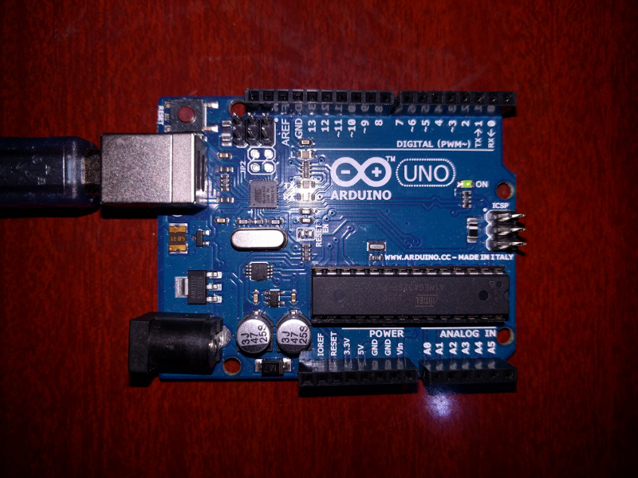
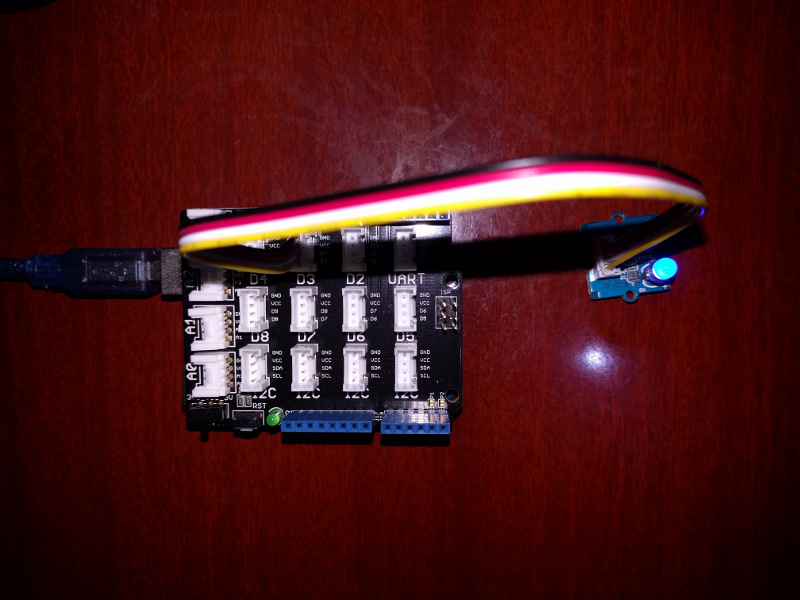
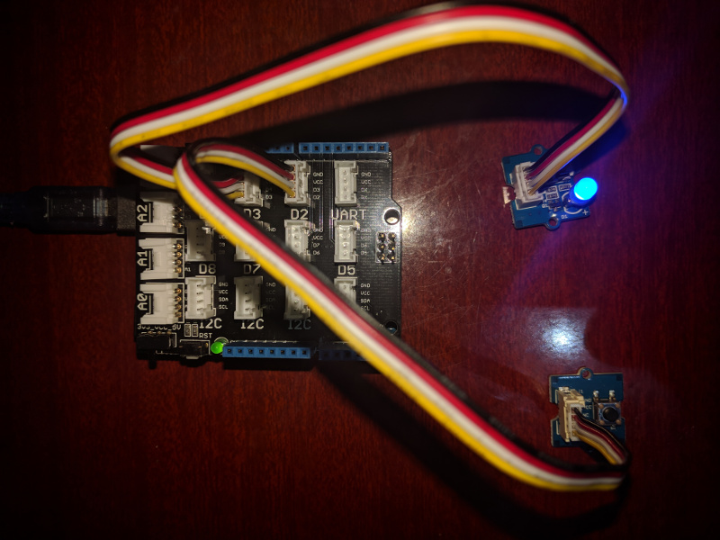
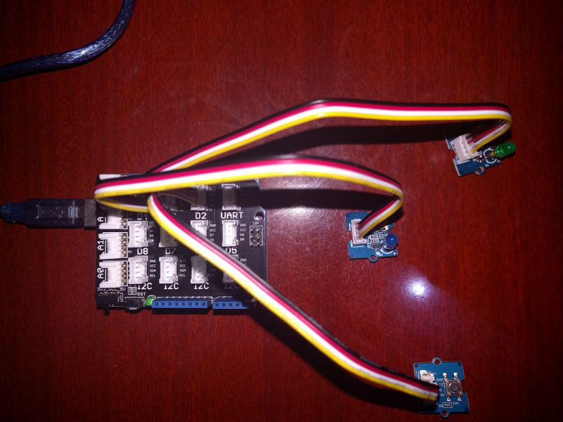
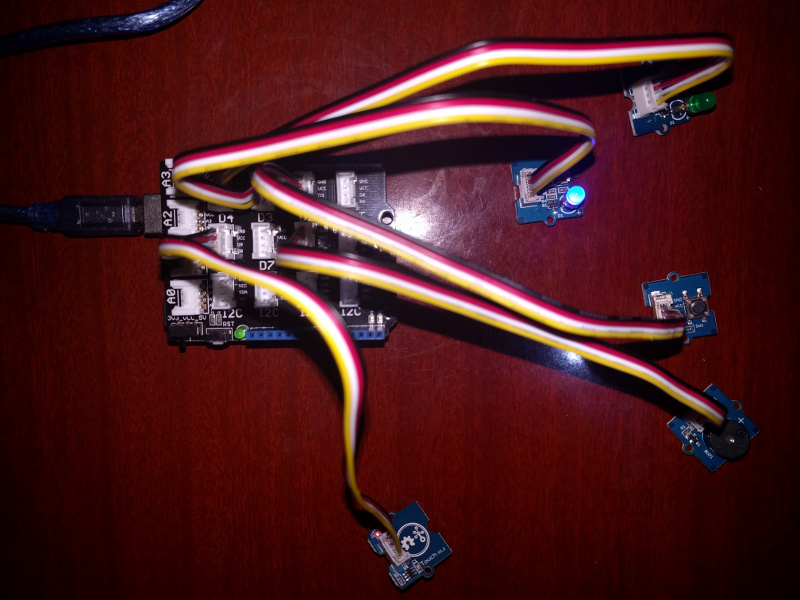
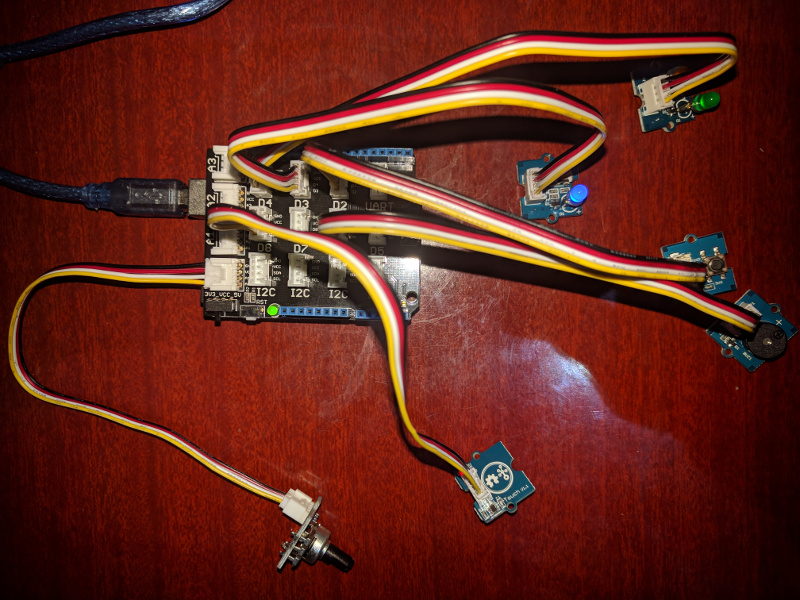
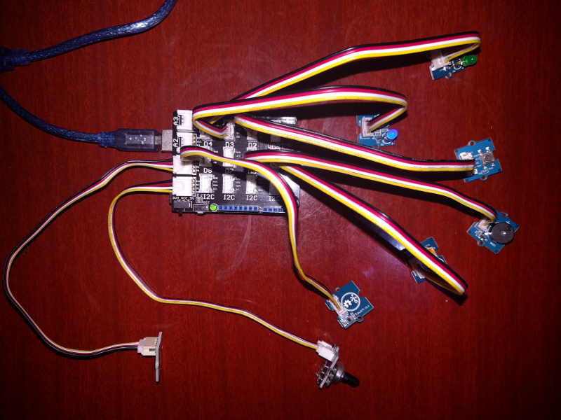
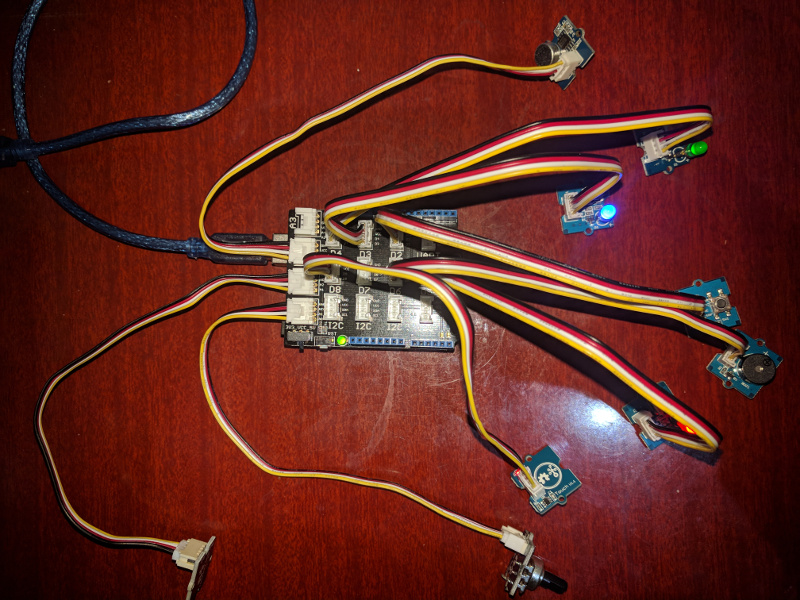
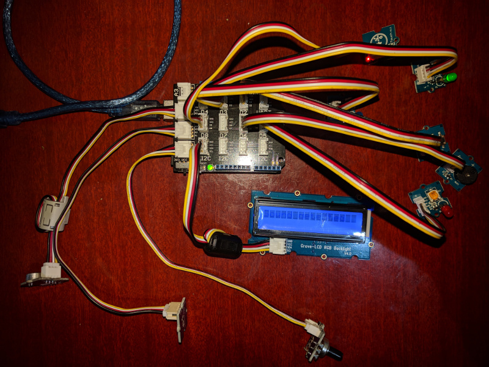

# Sensor Station

## Installation

```
go get -d -u gobot.io/x/gobot/...
```

## Connecting the Arduino to your computer

Plug the Arduino into your computer using the USB cable provided in your starter kit. The Firmata firmware that we use for controlling the Arduino from your computer has already been flashed onto the Arduino board.

## Running the code
When you run any of these examples, you will compile and execute the code on your computer.

To compile/run the code:

```
$ go run sensor/step1/main.go /dev/ttyACM0
```

If using Mac OS X then the Arduino will probably use a device name like `/dev/tty.usbmodem1421`. Perform a directory listing of `/dev/`; the Arduino is likely a device named using the pattern `/dev/tty.usbmodem`.

Substitute the name of the program and the name of your serial port as needed.

The Gobot program will use the serial interface to communicate with the connected Arduino that is running the Firmata firmware. Your Arduino already has Firmata installed for you. If you need to reload Firmata on your Arduino you can use Gort (http://gort.io)

## Code

### step0.go - Built-in LED



This tests that the Arduino is connected correctly to your computer, by blinking the built-in LED.

```
$ go run sensor/step0/main.go /dev/ttyACM0
```

### step1.go - Blue LED



Plug-in the Grove Shield to the top of the Arduino. Be careful not to bend the pins.

Connect the blue LED to D3.

Run the code:

```
$ go run sensor/step01/main.go /dev/ttyACM0
```

You should see the blue LED blink.

### step2.go - Blue LED, Button



Connect the button to D2.

Run the code:

```
$ go run sensor/step02/main.go /dev/ttyACM0
```

When you press the button, the blue LED should turn on. When you release the button, the blue LED should turn off.

### step3.go - Blue LED, Button, Green LED



Connect the Green LED to D4.

Run the code:

```
$ go run sensor/step03/main.go /dev/ttyACM0
```

When you press the button, the blue LED should turn on. When you release the button, the blue LED should turn off. The green LED should turn on or off each second.

### step4.go - Blue LED, Button, Green LED, MQTT

This step has us receiving a heartbeat signal from the "base station" using the MQTT machine to machine messaging protocol. No additional hardware needs to be connected. 

You will need the server location of the MQTT server to use for the base station.

The green LED should turn on or off based on the heartbeat message being received by the sensor station from the base station.

Run the code:

```
$ go run sensor/step04/main.go /dev/ttyACM0 tcp://192.168.1.55:1883
```

### step5.go - Blue LED, Button, Green LED, MQTT, Buzzer, Touch



Connect the buzzer to D6, and connect the touch sensor to D8.

Run the code:

```
$ go run sensor/step05/main.go /dev/ttyACM0 tcp://192.168.1.55:1883
```

When your finger touches the capacitive touch sensor, the buzzer should sound.

### step6.go - Blue LED, Button, Green LED, MQTT, Buzzer, Touch, Dial



Connect the rotary dial to A0.

Run the code:

```
$ go run sensor/step06/main.go /dev/ttyACM0 tcp://192.168.1.55:1883
```

Turning the dial will display the current analog reading on your console.

### step7.go - Blue LED, Button, Green LED, MQTT, Buzzer, Touch, Dial, Temperature, Red LED



Connect the temperature sensor to A1, and the red LED to D5

Run the code:

```
$ go run sensor/step07/main.go /dev/ttyACM0 tcp://192.168.1.55:1883
```

By default, if the temperature exceeds 30 degrees C, then the red LED will light up.
In case the room is warmer than 30 degrees C, change the default temperature in the constant `AlarmTemperature` in sensor/step07/main.go.

In order to increase the temperature of the sensor, hold it between your fingers and wait for the LED to light up.

To turn the LED off, let go of the temperature sensor (note: the temperature will drop much slower than it increased).

### step8.go - Blue LED, Button, Green LED, MQTT, Buzzer, Touch, Dial, Temperature, Red LED, Sound



Connect the sound sensor to A2.

Run the code:

```
$ go run sensor/step08/main.go /dev/ttyACM0 tcp://192.168.1.55:1883
```

When a sound is detected, the blue LED will light up, the sound sensor reading will be displayed on your computer's console.

### step9.go - Blue LED, Button, Green LED, MQTT, Buzzer, Touch, Dial, Temperature, Red LED, Sound


This step has us sending our temperature reading to the "base station" using the MQTT machine to machine messaging protocol. No additional hardware needs to be connected.

Run the code:

```
$ go run sensor/step09/main.go /dev/ttyACM0 tcp://192.168.1.55:1883
```

Whenever there is a temperature reading taken, the data will be sent to the server on an MQTT topic that corresponds to this device.

### step10.go - Blue LED, Button, Green LED, MQTT, Buzzer, Touch, Dial, Temperature, Red LED, Sound, LCD



Connect the LCD to any of the I2C ports on the Grove shield.

Run the code:

```
$ go run sensor/step10/main.go /dev/ttyACM0 tcp://192.168.1.55:1883
```

The LCD display will show informative messages, and also change the backlight color to match the color of whichever of the 3 LEDs is lit.

## License

Copyright (c) 2015-2017 The Hybrid Group. Licensed under the MIT license.
